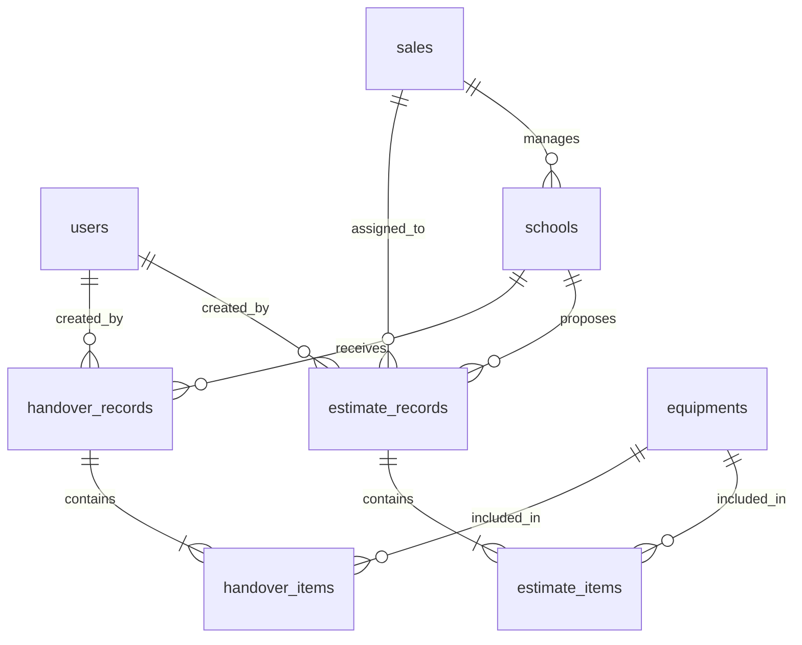

# BẢN HIẾN PHÁP DỰ ÁN CỐT LÕI (PROJECT_RULES.MD)
**Dự án**: EREMS (Equipment Record & Estimate Management System) - Hệ thống Quản lý Thiết bị & Xuất Biên bản Trường học

> [!IMPORTANT]
> **HƯỚNG DẪN DÀNH CHO AGENT**: Đọc kỹ toàn bộ tài liệu này trước khi tạo bất kỳ file nào hay viết bất kỳ dòng code nào. Mọi dòng code phải tuân thủ tuyệt đối quy định trong này.

---

## 1. MÔ TẢ TECH STACK & RÀNG BUỘC CÔNG NGHỆ (SYSTEM RULES)

### 1.1 Ngôn ngữ & Framework & Hạ tầng Web Hosting
- **Frontend**: React (Vite) + Tailwind CSS + Axios.
  - *Hosting*: Deploy lên **Vercel** hoặc **Netlify** để tối ưu hóa CDN và tốc độ tải trang client.
- **Backend**: Node.js + Express.
  - *Hosting*: Deploy lên **Render** hoặc **Railway** (hoặc VPS Dockerized).
  - *Cấu hình*: Bắt buộc thiết lập **CORS** chặt chẽ, chỉ cho phép domain Frontend đã deploy gọi tới API Backend.
- **Database**: PostgreSQL.
  - *Hosting*: Sử dụng các dịch vụ Database Cloud Managed như **Neon.tech**, **Supabase PostgreSQL**, hoặc **Render PostgreSQL** để đảm bảo khả năng truy cập an toàn, đồng thời từ internet và tự động backup dữ liệu.

### 1.2 Thư viện chỉ định (Bắt buộc)
- **Gọi API**: Chỉ sử dụng `axios` để gọi API, tuyệt đối KHÔNG sử dụng `fetch`.
- **Quản lý State**: Sử dụng `Zustand` cho state toàn cục (Global State) như lưu thông tin xác thực, giỏ hàng thiết bị tạm thời.
- **Xác thực**: Sử dụng `jsonwebtoken` và `cookie-parser` để quản lý phiên đăng nhập qua httpOnly Cookie.
- **Mã hóa**: Sử dụng `bcryptjs` để hash mật khẩu.
- **Sinh PDF**: Sử dụng thư viện xuất PDF thân thiện (ví dụ: `react-to-print` hoặc `jsPDF` ở client).

### 1.3 Quy ước Coding (Coding Conventions)
- **Components**: Tất cả các React components phải được viết dưới dạng **Functional Component** (`const ComponentName = () => { ... }`).
- **Tên biến & Hàm**: Sử dụng quy tắc đặt tên **camelCase** (ví dụ: `schoolId`, `handleCreateRecord`).
- **Tên file & Thư mục**:
  - Components React: Đặt theo chuẩn **PascalCase** (ví dụ: `AdminDashboard.jsx`, `SchoolForm.jsx`).
  - Routes, controllers, helpers ở backend: Đặt theo chuẩn **lowercase/kebab-case** (ví dụ: `auth-controller.js`, `school-route.js`).
- **Xử lý bất đồng bộ**: Ưu tiên sử dụng cú pháp `async/await` kết hợp với khối `try/catch` để xử lý ngoại lệ.
- **Định dạng Ngày tháng năm**: Toàn bộ dự án hiển thị ngày tháng năm theo định dạng **`dd/mm/yyyy`** (ví dụ: `19/07/2026`). Áp dụng nhất quán trên giao diện, bản in, toast thông báo và lịch sử. Sử dụng `toLocaleDateString('vi-VN')` hoặc hàm helper để format.

---

## 2. CẤU TRÚC DỮ LIỆU (DATABASE SCHEMA)



### 2.1 Bảng `users` (Xác thực và phân quyền)
- `id` (UUID, Primary Key, Default `gen_random_uuid()`)
- `username` (VARCHAR(50), Unique, Not Null)
- `password` (VARCHAR(255), Not Null) - Đã hash bằng bcrypt
- `full_name` (VARCHAR(100), Not Null)
- `role` (VARCHAR(20), Not Null, Default `'user'`) - Nhận giá trị: `'admin'`, `'user'`
- `created_at` (TIMESTAMP, Default `CURRENT_TIMESTAMP`)
- `updated_at` (TIMESTAMP, Default `CURRENT_TIMESTAMP`)

### 2.2 Bảng `sales` (Thông tin nhân viên Sales)
- `id` (UUID, Primary Key, Default `gen_random_uuid()`)
- `name` (VARCHAR(100), Not Null)
- `email` (VARCHAR(100), Unique, Not Null)
- `status` (VARCHAR(20), Default `'active'`) - Nhận giá trị: `'active'`, `'inactive'`
- `created_at` (TIMESTAMP, Default `CURRENT_TIMESTAMP`)

### 2.3 Bảng `schools` (Thông tin trường học)
- `id` (UUID, Primary Key, Default `gen_random_uuid()`)
- `name` (VARCHAR(150), Not Null)
- `sales_id` (UUID, Foreign Key referencing `sales.id`, Not Null) - Nhân viên Sales phụ trách trường
- `address` (VARCHAR(255))
- `representative` (VARCHAR(100))
- `created_at` (TIMESTAMP, Default `CURRENT_TIMESTAMP`)

### 2.4 Bảng `equipments` (Danh mục thiết bị)
- `id` (UUID, Primary Key, Default `gen_random_uuid()`)
- `equipment_code` (VARCHAR(50), Unique, Not Null)
- `name` (VARCHAR(150), Not Null)
- `specifications` (TEXT)
- `origin` (VARCHAR(100))
- `unit_price` (DECIMAL(12,2), Not Null)
- `stock_quantity` (INTEGER, Default `0`)
- `created_at` (TIMESTAMP, Default `CURRENT_TIMESTAMP`)

### 2.5 Bảng `handover_records` (Biên bản bàn giao thiết bị)
- `id` (UUID, Primary Key, Default `gen_random_uuid()`)
- `record_number` (VARCHAR(50), Unique, Not Null)
- `school_id` (UUID, Foreign Key referencing `schools.id`)
- `handover_date` (DATE, Not Null)
- `deliverer` (VARCHAR(100), Not Null)
- `receiver` (VARCHAR(100), Not Null)
- `notes` (TEXT)
- `created_by` (UUID, Foreign Key referencing `users.id`)
- `created_at` (TIMESTAMP, Default `CURRENT_TIMESTAMP`)

### 2.6 Bảng `handover_items` (Chi tiết thiết bị bàn giao)
- `id` (UUID, Primary Key, Default `gen_random_uuid()`)
- `handover_record_id` (UUID, Foreign Key referencing `handover_records.id`, ON DELETE CASCADE)
- `equipment_id` (UUID, Foreign Key referencing `equipments.id`)
- `quantity` (INTEGER, Not Null)
- `status_note` (VARCHAR(255)) - Trạng thái lúc bàn giao (Ví dụ: "Mới 100%", "Có trầy xước nhẹ")

### 2.7 Bảng `estimate_records` (Dữ liệu dự trù nhu cầu thiết bị)
- `id` (UUID, Primary Key, Default `gen_random_uuid()`)
- `estimate_number` (VARCHAR(50), Unique, Not Null)
- `school_id` (UUID, Foreign Key referencing `schools.id`)
- `sales_id` (UUID, Foreign Key referencing `sales.id`)
- `proposed_date` (DATE, Not Null)
- `total_amount` (DECIMAL(15,2), Default `0.00`)
- `status` (VARCHAR(20), Default `'draft'`) - Nhận giá trị: `'draft'`, `'pending'`, `'approved'`
- `created_by` (UUID, Foreign Key referencing `users.id`)
- `created_at` (TIMESTAMP, Default `CURRENT_TIMESTAMP`)

### 2.8 Bảng `estimate_items` (Chi tiết thiết bị trong dự trù)
- `id` (UUID, Primary Key, Default `gen_random_uuid()`)
- `estimate_record_id` (UUID, Foreign Key referencing `estimate_records.id`, ON DELETE CASCADE)
- `equipment_id` (UUID, Foreign Key referencing `equipments.id`)
- `quantity` (INTEGER, Not Null)
- `unit_price` (DECIMAL(12,2), Not Null) - Lưu cứng đơn giá tại thời điểm dự trù

---

## 3. MÔ TẢ GIAO DIỆN & TƯƠNG TÁC (UI-TO-FEATURE MATRIX)

### 3.1 Bố cục Layout Tổng thể
- **Trang Đăng nhập (Auth)**: Form căn giữa màn hình, nền gradient tối giản, không chứa Navigation bar hay Sidebar.
- **Hệ thống Dashboard (Sau đăng nhập)**:
  - **Sidebar bên trái**: Chứa liên kết danh mục điều hướng nhanh (Dashboard, Trường Học, Sales, Thiết Bị, Lập Dự Trù, Lập Bàn Giao). Sidebar có thể thu nhỏ linh hoạt.
  - **Header ở trên**: Hiển thị đường dẫn (Breadcrumbs), tên người dùng đăng nhập hiện tại, nút Đăng xuất.
  - **Khu vực hiển thị chính (Main Content)**: Sử dụng cấu hình responsive Grid/Flex, bo góc tinh tế (`rounded-lg`), hiệu ứng đổ bóng mờ (`shadow-sm`).

### 3.2 Trạng thái Giao diện (State Representation)
- **Loading**: Sử dụng các thành phần Skeleton mờ nhẹ thay vì vòng xoay (Spinner) tròn mặc định để mang lại cảm giác premium.
- **Error**: Hiển thị thông báo Toast góc phải màn hình màu đỏ nhẹ (Muted Red, không dùng màu đỏ tươi chói).
- **Success**: Hiển thị thông báo Toast màu xanh lục thảo mộc dịu nhẹ (Sage Green) và đóng Modal tự động.
- **Empty State**: Khi danh sách trống, hiển thị hình vẽ minh họa tối giản và thông điệp hướng dẫn cụ thể thay vì màn hình trống trơn.

### 3.3 Quy tắc cho từng trang giao diện (Page-Specific Rules)

#### A. Trang Đăng nhập (Login Page)
- **Cấu trúc Giao diện**: Form nằm chính giữa màn hình (`flex items-center justify-center`), nền tối có hiệu ứng gradient tròn mờ ảo ở các góc. Form dạng thẻ bo tròn (`rounded-2xl`) nền nửa trong suốt (Glassmorphism), viền mảnh.
- **Tính năng**:
  1. *Đăng nhập bằng tài khoản*: Form nhập tên đăng nhập (`username`) và mật khẩu (`password`).
  2. *Trạng thái chờ (Loading)*: Nút đăng nhập hiển thị hiệu ứng xoay tròn và vô hiệu hóa các trường nhập liệu khi đang gửi yêu cầu.
  3. *Hiển thị lỗi*: Khung đỏ cảnh báo hiển thị ngay trên form khi sai thông tin hoặc thiếu dữ liệu đầu vào.
- **Mô tả tính năng**: Sau khi điền đúng thông tin, hệ thống sẽ chuyển đổi trạng thái đăng nhập toàn cục và chuyển sang giao diện Dashboard.

#### B. Trang Tổng quan (Dashboard Page)
- **Cấu trúc Giao diện**: Cấu trúc lưới gồm 3 phần chính: Banner chào mừng ở trên cùng, Grid 4 cột hiển thị thẻ số liệu (Stats cards), và chia cột bên dưới (2/3 cho lịch sử hoạt động, 1/3 cho các liên kết hành động nhanh).
- **Tính năng**:
  1. *Thống kê nhanh*: Hiển thị tổng số trường học, thiết bị, dự trù, và biên bàn giao. Có icon đại diện và độ tăng trưởng giả lập.
  2. *Hoạt động gần nhất*: Danh sách các thao tác vừa thực hiện trên hệ thống kèm trạng thái (Chờ duyệt, Thành công).
  3. *Hành động nhanh*: Lối tắt điều hướng nhanh tới việc thêm trường, lập dự trù, bàn giao.
- **Mô tả tính năng**: Cho phép Admin/User có cái nhìn tổng quan về khối lượng công việc và tình hình cấp phát thiết bị.

#### C. Trang Quản lý Trường học (Schools Page)
- **Cấu trúc Giao diện**: Cấu trúc lưới linh hoạt: Đối với Admin, màn hình chia làm 2 phần (bảng danh sách trường học bên trái, form Thêm/Sửa thông tin bên phải). Đối với User thường (Sales), bảng danh sách chiếm toàn màn hình rộng để tăng tính hiển thị.
- **Tính năng**:
  1. *Danh sách trường học*: Hiển thị tên trường học, nhân viên Sales phụ trách, người đại diện và địa chỉ.
  2. *Thêm/Sửa/Xóa trường (Chỉ dành cho Admin)*: Chỉ tài khoản Admin mới có form và các nút Thao tác để Thêm, Chỉnh sửa thông tin, hoặc Xóa trường học khỏi hệ thống. Tài khoản User thường chỉ có quyền xem danh sách và tìm kiếm.
  3. *Tìm kiếm nhanh*: Ô tìm kiếm lọc danh sách trường học theo tên trường học theo thời gian thực (Real-time).
- **Mô tả tính năng**: Đóng vai trò quản lý danh mục đối tác nhận thiết bị của hệ thống.

#### D. Trang Quản lý Nhân viên Sales (Sales Page)
- **Cấu trúc Giao diện**: Bảng hiển thị danh sách nhân viên Sales với các cột thông tin liên hệ và trạng thái. Phía trên có nút "Thêm Sales" mở Modal nhập liệu.
- **Tính năng**:
  1. *Xem danh sách*: Hiển thị tên, email, số điện thoại và trạng thái (Đang hoạt động/Tạm ngưng).
  2. *Thêm/Sửa/Xóa sales (Chỉ Admin)*: Quản lý thông tin chi tiết của nhân viên kinh doanh.
- **Mô tả tính năng**: Phục vụ việc giao phó và theo dõi hiệu suất lập dự toán thiết bị của từng nhân viên kinh doanh.

#### E. Trang Danh mục Thiết bị (Equipments Page)
- **Cấu trúc Giao diện**: Bảng lưới (Table) hiển thị danh mục thiết bị chung, kèm thông số kỹ thuật và số lượng tồn kho. Có bộ lọc tìm kiếm theo mã hoặc tên thiết bị.
- **Tính năng**:
  1. *Quản lý kho thiết bị*: Admin cập nhật mã thiết bị, tên, đơn giá tiêu chuẩn, xuất xứ, thông số và số lượng tồn.
  2. *Kiểm tra tồn kho*: Cảnh báo bằng màu sắc nếu số lượng tồn kho của thiết bị bằng 0.
- **Mô tả tính năng**: Là thư viện danh mục thiết bị chuẩn để áp dụng đơn giá đồng bộ khi lập dự trù và biên bản bàn giao.

#### F. Trang Lập Dự Trù Thiết Bị (Estimates Page)
- **Cấu trúc Giao diện**: Chia tỷ lệ 2:1. Cột lớn bên trái là form lập dự thảo dự trù với bảng thêm dòng thiết bị linh hoạt. Cột nhỏ bên phải hiển thị danh sách các bản dự trù đã lập gần đây để truy cập nhanh.
- **Tính năng**:
  1. *Lập danh sách dự trù*: Chọn trường học nhận, chọn sales phụ trách, thêm hàng loạt thiết bị với số lượng tương ứng.
  2. *Tự động tính tiền*: Client tự động nhân số lượng với đơn giá của từng dòng, cập nhật tổng số tiền dự thảo tức thì.
  3. *Xem chi tiết & In ấn (PDF)*: Mở Modal hiển thị mẫu văn bản in ấn chuẩn chỉ, hỗ trợ in hoặc lưu file PDF trực tiếp từ trình duyệt.
- **Mô tả tính năng**: Dành cho sales hoặc admin lập bảng tính toán dự toán kinh phí thiết bị cho từng trường học và lưu trữ vào database.

#### G. Trang Lập Biên Bản Bàn Giao (Handovers Page)
- **Cấu trúc Giao diện**: Tương tự trang dự trù, gồm form nhập biên bản bàn giao thực tế (bên giao, bên nhận, ngày giao, trạng thái thiết bị) và bảng hiển thị lịch sử biên bản đã ký.
- **Tính năng**:
  1. *Lập biên bản bàn giao*: Ghi nhận chi tiết số lượng thiết bị thực tế bàn giao kèm ghi chú trạng thái vật lý (Mới 100%, cũ hỏng...).
  2. *Xuất in biên bản ký nhận*: Hỗ trợ xuất mẫu biên bản bàn giao có phần ký tên đại diện hai bên để thực hiện lưu trữ hồ sơ giấy tờ.
- **Mô tả tính năng**: Xác nhận hoàn thành quá trình cấp phát thiết bị từ kho tới các trường học.

---

## 4. MÔ TẢ LUỒNG NGHIỆP VỤ (USER FLOWS & LOGIC)

### 4.1 Luồng Đăng nhập (Login Flow)
1. User nhập Username và Password -> Click Đăng nhập.
2. Client gọi API `/api/auth/login`.
3. Backend kiểm tra, nếu thông tin sai -> Trả về lỗi. Nếu đúng -> Tạo JWT, lưu JWT vào HTTPOnly Cookie, trả về thông tin User (không kèm password).
4. Client lưu trữ thông tin User vào Zustand store toàn cục và chuyển hướng về trang `/dashboard`.

### 4.2 Luồng Tạo Bản Dự Trù (Create Estimate Flow)
1. Người dùng chọn Trường học từ danh sách thả xuống.
2. Chọn nhân viên Sales phụ trách.
3. Chọn danh sách thiết bị cần dự trù (chọn nhiều thiết bị, nhập số lượng). Hệ thống tính toán tổng tiền tạm tính tự động tại Client.
4. Nhấp "Lưu Dự Trù" -> Gọi API POST `/api/estimates`. 
5. Backend ghi thông tin vào `estimate_records` và `estimate_items` (trong một Transaction để đảm bảo tính toàn vẹn dữ liệu).
6. Khi lưu thành công -> Hiển thị thông báo, tự động điều hướng về trang Chi tiết bản dự trù để người dùng xem hoặc nhấp "In/Xuất PDF".

### 4.3 Luồng Phân quyền Đặc quyền (RBAC Logic)
- Khi User truy cập vào thanh điều hướng (Sidebar):
  - **Admin**: Có quyền truy cập các mục: *Dashboard*, *Quản lý Trường học*, *Quản lý Sales*, *Danh mục Thiết bị*, *Biên bản Bàn giao*. **Ẩn hoàn toàn** mục *Bản dự trù Thiết bị*.
  - **User thường (Sales)**: Có quyền truy cập các mục: *Dashboard*, *Bản dự trù Thiết bị*, *Biên bản Bàn giao*. **Ẩn hoàn toàn** các mục quản trị nâng cao (*Quản lý Trường học*, *Quản lý Sales*, *Danh mục Thiết bị*).
- Ở phía Backend:
  - Tất cả API chỉnh sửa (POST/PUT/DELETE) danh mục Trường học, Sales và Thiết bị đều phải chạy qua middleware kiểm tra quyền Admin (`req.user.role === 'admin'`). Nếu không đúng, trả về ngay lập tức lỗi `403 Forbidden`.

---

## 5. MÔ TẢ BẢO MẬT & XỬ LÝ LỖI (SECURITY RULES)

### 5.1 Ràng buộc Bảo mật
- **Xác thực JWT**: JWT token phải được lưu trong **httpOnly cookie** bảo mật. Tuyệt đối không lưu token trong `localStorage` hay `sessionStorage` để phòng tránh tấn công XSS.
- **Mã hóa Mật khẩu**: Sử dụng `bcryptjs` with salt rounds là `10` để mã hóa mật khẩu khi đăng ký hoặc đổi mật khẩu.
- **Ràng buộc đầu vào**: Mọi tham số đầu vào gửi lên Backend phải được kiểm tra kiểu dữ liệu và escape chuỗi ký tự để phòng tránh SQL Injection.

### 5.2 Chuẩn hóa API Response (Bắt buộc)
Mọi API trả về từ Backend phải định dạng chính xác theo cấu trúc JSON duy nhất sau:
```json
{
  "success": true, // hoặc false
  "data": {},      // chứa dữ liệu trả về hoặc null
  "message": ""    // thông báo thành công hoặc mô tả lỗi chi tiết
}
```

---

## 6. QUY TẮC THỰC THI CHO AGENT (AGENT DIRECTIVES)

### 6.1 Nguyên tắc Micro-Steps (Chia nhỏ bước thực hiện)
- Khi nhận yêu cầu viết code, Agent **chỉ thực hiện đúng 1 bước nhỏ nhất** được phân chia.
- Ví dụ: Chỉ viết API backend. Sau khi viết xong và xuất code ra file, Agent **phải dừng lại hoàn toàn và chờ phản hồi kiểm duyệt của người dùng**, tuyệt đối không tự ý kết nối frontend hoặc làm tiếp bước sau.

### 6.2 Giới hạn không gian làm việc
- Agent chỉ được đọc và chỉnh sửa các file thuộc thư mục dự án `d:\bienbanprj`.
- Không tự ý sửa đổi cấu hình môi trường bên ngoài khi chưa được phép.
- Trước khi chỉnh sửa một file bất kỳ, Agent phải thông báo dòng tóm tắt kế hoạch chỉnh sửa cho người dùng biết.

### 6.3 Kiểm tra biên dịch & Không để lại lỗi cú pháp
- Sau khi chỉnh sửa code, Agent phải kiểm tra trạng thái biên dịch của dự án (kiểm tra log tiến trình Vite, Express backend server) để đảm bảo không để lại bất kỳ lỗi cú pháp (SyntaxError), parser error, hay lỗi import nào trước khi báo cáo kết quả hoàn thành cho người dùng.

### 6.4 BẮT BUỘC KIỂM THỬ TRƯỚC KHI BÁO HOÀN THÀNH (TEST BEFORE DONE)
- Agent tuyệt đối không được báo cáo hoàn thành (Done) hoặc trả lời người dùng khi chưa tự mình kiểm thử lại tính đúng đắn của code.
- Phải kiểm tra log terminal, chắc chắn rằng giao diện frontend (Vite) không báo lỗi đỏ, và backend không crash trước khi chuyển sang bước tiếp theo hoặc kết thúc công việc.

---

## 7. PHƯƠNG ÁN TRIỂN KHAI HOSTING LÊN WEB (WEB HOSTING & DEPLOYMENT PLAN)

Tất cả đề xuất công nghệ và cấu trúc dự án đều tuân thủ nguyên tắc **"Cloud-ready"** (sẵn sàng đưa lên môi trường web hosting trực tuyến) với các đề xuất chi tiết sau:

### 7.1 Đề xuất Nền tảng Hosting & Dịch vụ Cloud
- **Frontend (Client)**: 
  - **Nền tảng**: **Vercel** hoặc **Netlify** (Miễn phí cho cá nhân).
  - **Cơ chế**: Kết nối trực tiếp với GitHub Repository để tự động kích hoạt quá trình Build & Deploy mỗi khi có commit mới (CI/CD).
- **Backend (Server)**:
  - **Nền tảng**: **Render** hoặc **Railway** (Tối ưu hóa chạy Node.js/Express Web Service).
  - **Cơ chế**: Đóng gói mã nguồn Backend và cấu hình Port lắng nghe động thông qua biến môi trường `process.env.PORT`.
- **Database (Cơ sở dữ liệu)**:
  - **Nền tảng**: **Neon.tech** hoặc **Supabase** (Cung cấp cơ sở dữ liệu PostgreSQL Cloud được quản lý hoàn toàn).
  - **Lợi ích**: Có sẵn chuỗi kết nối bảo mật `postgresql://...` chạy qua giao thức mạng internet công cộng an toàn, cho phép cả máy local và server cloud Render kết nối đồng thời.

### 7.2 Quy định cấu hình biến môi trường để Host (Environment Configuration)
Tuyệt đối không viết cứng (hardcode) địa chỉ localhost trong code sản phẩm. Mọi kết nối phải được cấu hình thông qua **Environment Variables** khi cấu hình trên các trang Web Hosting:
- **Ở Frontend**: 
  - Sử dụng biến `import.meta.env.VITE_API_URL` để gọi API Backend thay vì ghi cứng `http://localhost:5000`. Khi deploy, sẽ khai báo biến này trỏ về domain API đã chạy thực tế trên Render.
- **Ở Backend**:
  - `PORT`: Đặt động `process.env.PORT || 5000`. Các hosting như Render sẽ tự động gán Port động phù hợp cho container của backend.
  - `DATABASE_URL`: Trỏ về chuỗi kết nối của Neon/Supabase PostgreSQL.
  - `CLIENT_URL`: Trỏ về tên miền đã deploy của Frontend để cấu hình CORS cho phép trao đổi cookie đăng nhập an toàn.
  - `JWT_SECRET`: Khóa bảo mật ký token JWT, cấu hình ngẫu nhiên trên Cloud.
  - `NODE_ENV`: Đặt là `'production'`.
- **Quy tắc về CORS & Cookie**: Khi ở môi trường Web Host thực tế (`production`), cookie JWT phải bật cấu hình bảo mật `secure: true, sameSite: 'none'` để hỗ trợ truyền cookie chéo domain HTTPS giữa Frontend (Vercel) và Backend (Render).
